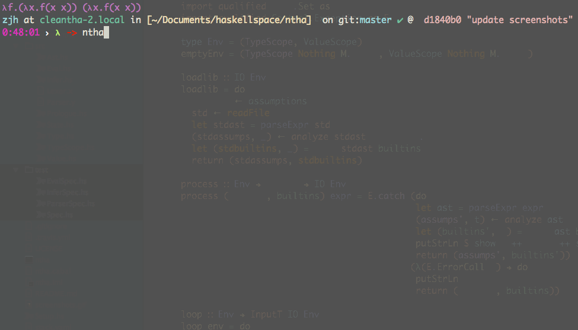

# Ntha Programming Language

[](https://travis-ci.org/zjhmale/Ntha)
[](https://github.com/zjhmale)
[](https://en.wikipedia.org/wiki/Haskell_(programming_language))

a tiny statically typed functional programming language.

## Features

* Global type inference with optional type annotations.
* Lisp flavored syntax with Haskell like semantic inside.
* Support basic types: Integer, Character, String, Boolean, Tuple, List and Record.
* Support unicode keywords.
* Support destructuring.
* ADTs and pattern matching.
* Haskell like type signature for type checking.
* Refined types (still in early stage, just support basic arithmetic operations and propositinal logic :joy: [here is some examples](https://github.com/zjhmale/Ntha/blob/master/examples/misc.ntha#L188-195)).
* Support pattern matching on function parameters.
* Lambdas and curried function by default.
* Global and Local let binding.
* Recursive functions.
* If-then-else / Cond control flow.
* Type alias.
* Do notation.
* Begin block.

## Future Works

* Atoms (need to handle mutable state in evaluation procedure, reference to the [implementation of Clea Programming Language](https://github.com/zjhmale/Clea/blob/master/src/Prologue.hs#L191-211)).
* Module system (also need to get a monadic evaluation procedure to read file content).
* error propagation (try / catch).
* Lazyness.
* JIT backend.
* Type-classes (desuger to Records).
* Rank-N types ([a naive implementation of First-Class Polymorphism](https://github.com/zjhmale/HMF/tree/master/src/FCP)).
* Dependent types.
* Fully type checked lisp like macros (comply with the internal design of Template Haskell).
* TCO.

## Screenshot



## Example

```Clojure
(type Name String)
(type Env [(Name . Expr)])

(data Op Add Sub Mul Div Less Iff)

(data Expr
  (Num Number)
  (Bool Boolean)
  (Var Name)
  (If Expr Expr Expr)
  (Let [Char] Expr Expr)
  (LetRec Name Expr Expr)
  (Lambda Name Expr)
  (Closure Expr Env)
  (App Expr Expr)
  (Binop Op (Expr . Expr)))

(let op-map {:add +
             :sub -
             :mul *
             :div /
             :less <
             :iff =})

(arith-eval : (α → (β → Z)) → ((α × β) → (Maybe Expr)))
(ƒ arith-eval [fn (v1 . v2)]
  (Just (Num (fn v1 v2))))

(logic-eval : (α → (β → B)) → ((α × β) → (Maybe Expr)))
(ƒ logic-eval [fn (v1 . v2)]
  (Just (Bool (fn v1 v2))))

(let eval-op
  (λ op v1 v2 ⇒
    (match (v1 . v2)
      (((Just (Num v1)) . (Just (Num v2))) ⇒
        (match op
          (Add ⇒ (arith-eval (:add op-map) (v1 . v2)))
          (Sub ⇒ (arith-eval (:sub op-map) (v1 . v2)))
          (Mul ⇒ (arith-eval (:mul op-map) (v1 . v2)))
          (Div ⇒ (arith-eval (:div op-map) (v1 . v2)))
          (Less ⇒ (logic-eval (:less op-map) (v1 . v2)))
          (Iff ⇒ (logic-eval (:iff op-map) (v1 . v2)))))
      (_ ⇒ Nothing))))

(eval : [(S × Expr)] → (Expr → (Maybe Expr)))
(ƒ eval [env expr]
  (match expr
    ((Num _) ⇒ (Just expr))
    ((Bool _) → (Just expr))
    ((Var x) ⇒ (do Maybe
                 (val ← (lookup x env))
                 (return val)))
    ((If condition consequent alternative) →
          (match (eval env condition)
            ((Just (Bool true)) → (eval env consequent))
            ((Just (Bool false)) → (eval env alternative))
            (_ → (error "condition should be evaluated to a boolean value"))))
    ((Lambda _ _) → (Just (Closure expr env)))
    ((App fn arg) → (let [fnv (eval env fn)]
                      (match fnv
                        ((Just (Closure (Lambda x e) innerenv)) →
                            (do Maybe
                              (argv ← (eval env arg))
                              (eval ((x . argv) :: innerenv) e)))
                        (_ → (error "should apply arg to a function")))))
    ((Let x e1 in-e2) ⇒ (do Maybe
                          (v ← (eval env e1))
                          (eval ((x . v) :: env) in-e2)))
    ;; use fix point combinator to approach "Turing-complete"
    ((LetRec x e1 in-e2) → (eval env (Let "Y" (Lambda "h" (App (Lambda "f" (App (Var "f") (Var "f")))
                                                               (Lambda "f" (App (Var "h")
                                                                                (Lambda "n" (App (App (Var "f") (Var "f"))
                                                                                                 (Var "n")))))))
                                              (Let x (App (Var "Y") (Lambda x e1))
                                                     in-e2))))
    ((Binop op (e1 . e2)) => (let [v1 (eval env e1)
                                   v2 (eval env e2)]
                               (eval-op op v1 v2)))))

(begin
  (print "start")
  (let result (match (eval [] (LetRec "fact" (Lambda "n" (If (Binop Less ((Var "n") . (Num 2)))
                                                             (Num 1)
                                                             (Binop Mul ((Var "n") . (App (Var "fact")
                                                                                          (Binop Sub ((Var "n") . (Num 1))))))))
                                             (App (Var "fact") (Num 5))))
                ((Just (Num num)) ⇒ (print (int2str num)))
                (Nothing ⇒ (error "oops"))))
  (print result)
  (print "finish"))
```

## License

Copyright © 2016 zjhmale

Distributed under the [](https://en.wikipedia.org/wiki/BSD_licenses)
